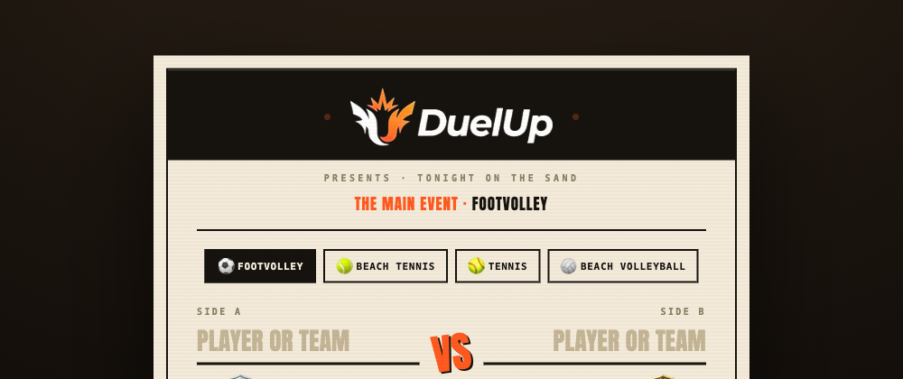
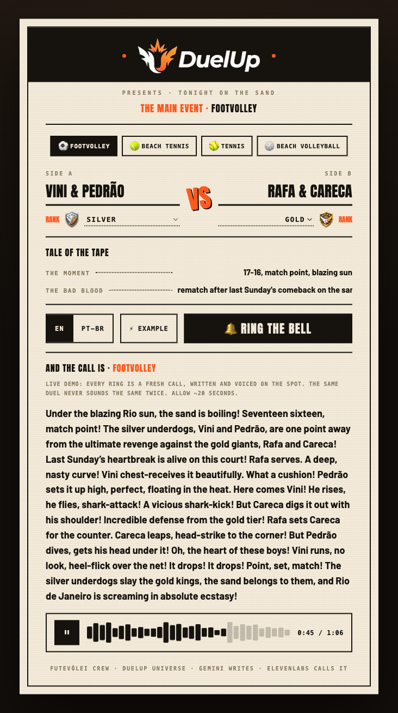

# DuelUp Live 🔔

**The AI announcer for beach-sport duels, on a vintage fight bill.** Pick the sport, write in the two sides with their nicknames and ranks, set the moment and the bad blood, ring the bell, and an electrifying sports announcer calls the match live. Gemini writes the play-by-play, ElevenLabs gives it a voice.



**🔔 Live demo: [live.duelup.app](https://live.duelup.app)** &nbsp;·&nbsp; **📝 Write-up: [dev.to post](https://dev.to/vinimabreu/i-gave-my-futevolei-crew-an-ai-announcer-duelup-live-4h60)**

Built for the [DEV Weekend Challenge: Passion Edition](https://dev.to/challenges/weekend-2026-07-09), and for my real futevôlei crew.

Part of the **DuelUp** universe, a competitive platform for amateur beach sports (ELO ranking, tiers from Sand to Legend, virtual-coin stakes) that I built for my own group. DuelUp Live gives our duels the one thing they were missing: a voice.

## A call, live

Ring the bell and the announcer opens the card. Every ring is a fresh call.



## How it works

```
The fight bill (sides, ranks, the moment, the bad blood)
        │  🔔 ring the bell
        ▼
POST /api/narrate  ──► Gemini (gemini-flash-latest)
        │                writes a 90-120 word play-by-play call, EN or PT-BR
        ▼
POST /api/voice    ──► ElevenLabs (eleven_multilingual_v2)
        │                Brazilian announcer voice for PT, energetic English voice for EN
        ▼
   MP3 on the bill's waveform player (wired to the real audio element)
```

- **Next.js 14** (App Router), zero extra runtime dependencies, plain REST calls, no SDKs
- **Every ring is a fresh call** (temperature 1.0): the same duel never sounds the same twice
- **Thinking disabled** (`thinkingBudget: 0`): an announcer should not overthink; without this, reasoning tokens ate the output budget and truncated calls mid-sentence
- **Model cascade**: 503 on `gemini-flash-latest` falls through to `gemini-flash-lite-latest`, then `gemini-2.0-flash`, so the demo survives provider traffic spikes
- **Sport-aware prompt**: tennis gets called on the court, everything else on the sand; the rank tiers (from DuelUp's real ELO system) are woven in as underdog-versus-favorite drama
- **12 ready duels**: three per sport, cycling on the ⚡ Example button, each with its own arc
- The rank badge art is the real DuelUp tier art (Sand → Legend)

## Run it

```bash
cp .env.example .env   # add your keys
npm install
npm run dev            # http://localhost:3201
```

| Env var | Where to get it |
|---|---|
| `GOOGLE_API_KEY` | [Google AI Studio](https://aistudio.google.com) |
| `ELEVENLABS_API_KEY` | [ElevenLabs](https://elevenlabs.io) (needs Text to Speech + voices read access) |

---

Vinicius Pereira · [vinimabreu.dev](https://vinimabreu.dev) · [github.com/vinimabreu](https://github.com/vinimabreu)
